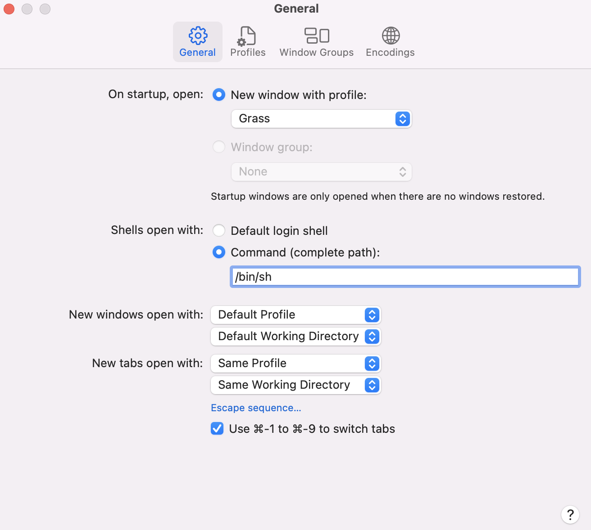

# Prerequisite for a new PC/Mac before they can do scientific analyses

## Google Earth Engine (GEE)
- Command line tool installation (for PC)
  1. Conda install<br/>
  Follow [this page](https://developers.google.com/earth-engine/guides/python_install-conda).<br/>
  2. Install the Google Cloud CLI<br/>
  Follow [this page](https://cloud.google.com/sdk/docs/install-sdk).<br/>
  3. Make python3 available<br/>
  Follow [this page](https://stackoverflow.com/questions/39910730/python3-is-not-recognized-as-an-internal-or-external-command-operable-program).<br/>
  4. Install geeup<br/>
  First re-open Terminal, and enter the ee environment you just created by `conda activate ee`. Install geeup by the command `pip install geeup`. After installation, test it by `geeup -h`.<br/>
  5. Install geopandas<br/>
  `conda install geopandas`.<br/>
  6. Set up geeup (cookies)<br/>
  Follow [this page](https://samapriya.github.io/geeup/).<br/>
  7. Examples<br/>
     - help
     ```
     geeup -h
     ```
     - get metadata
     ```
     geeup getmeta --input "C:/Users/jzhao/Downloads/nc" --metadata "C:/Users/jzhao/Downloads/nc/metadata.csv"
     ```
     - image batch upload
     ```
     geeup upload --source "C:/Users/jzhao/Downloads/tif" --dest "projects/ee-jzhao-external-dataset/assets/raster/urban-climate-in-europe/paris" -m "C:/Users/jzhao/Downloads/tif/metadata.csv" -u "zhao_jiacheng@outlook.com"
     ```
     - delete image/image collection
     ```
     geeup delete "projects/ee-jzhao-external-dataset/assets/raster/urban-climate-in-europe/paris"
     ```
  
- Command line tool installation (for Mac)
  1. Use /bin/sh<br/>
  Open Terminal on Mac then `command + ,` to Preferences. Change Default login shell to /bin/sh.<br/>
      <br/>
      
      <br/>
  2. Conda install<br/>
  Follow [this page](https://developers.google.com/earth-engine/guides/python_install-conda).<br/>
  3. Install the Google Cloud CLI<br/>
  Follow [this page](https://cloud.google.com/sdk/docs/install-sdk).<br/>
  4. Install pip on Mac<br/>
  Follow [this page](https://www.geeksforgeeks.org/how-to-install-pip-in-macos/). You may need to install the command line developer tools.<br/>
  5. Set up environmental variables<br/>
     - Create a profile file if you don't have one by opening Terminal and issuing the command `touch .profile`, then close Terminal.<br/>
     - Add the two lines below to the profile file either manully (the file should be hidden in /Users/\<your username>\/.profile) or by `vim ~/.profile`.<br/>
     ```
     export PATH=/Users/<your username>/miniconda3/bin:$PATH
     export PATH=/Users/<your username>/google-cloud-sdk/bin:$PATH
     ```
  6. Install geeup<br/>
  First re-open Terminal, and enter the ee environment you just created by `source $HOME/miniconda3/bin/activate` and then `conda activate ee`. Install geeup by the command `pip install geeup`. After installation, test it by `geeup -h`.<br/>
  7. Set up geeup (cookies)<br/>
  Follow [this page](https://samapriya.github.io/geeup/).<br/>
	
  
  `geeup getmeta --input "C:/Users/jzhao/Downloads/nc" --metadata "C:/Users/jzhao/Downloads/nc/metadata.csv"`
  
Python was not found; run without arguments to install from the Microsoft Store, or disable this shortcut from Settings
https://stackoverflow.com/questions/65348890/python-was-not-found-run-without-arguments-to-install-from-the-microsoft-store
- Image batch upload
```
geeup upload --source "D:/Data/MSWX/Monthly/Processed" --dest "projects/ee-jzhao-external-dataset/assets/raster/mswx/past/monthly" -m "D:/Data/MSWX/Monthly/Processed/metadata.csv" -u "zhao_jiacheng@outlook.com"
```
## R
- Create an r package
```
require(devtools)
setwd('C:/Users/jzhao/Documents/Nutstore/Projects')
create('smot')
```
- Import windows fonts to R
```
install.packages('remotes')
remotes::install_version("Rttf2pt1", version = "1.3.8")
install.packages('extrafont')
extrafont::font_import()
extrafont::loadfonts(device = "win")
fonts()
```

- Rstudio header
```
snippet header
	## ----------------------------------
	# Title: 
	# Objective: 
	# Created by: Jiacheng Zhao
	# Created on: `r Sys.Date()`
	# Copyright (c) Jiacheng Zhao, `r format(Sys.Date(), "%Y")`
	# Beijing Normal University
	# Email: zhaojiacheng@mail.bnu.edu.cn
	## ----------------------------------
```


